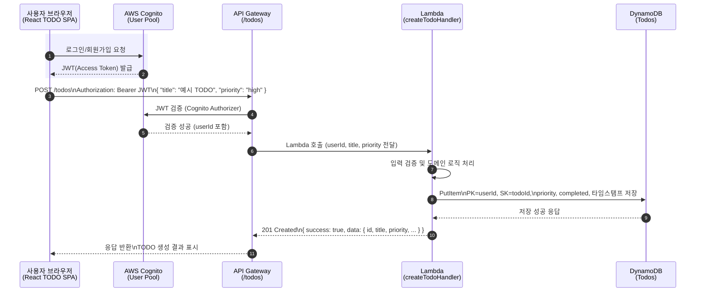
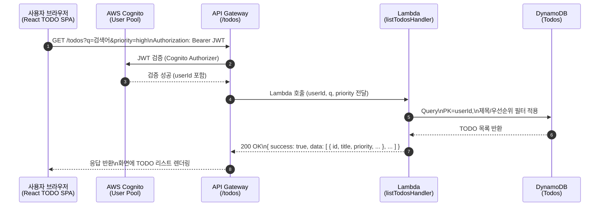

## TODO 웹 앱 설계서

`docs/requirements.md`에 정리된 요구사항을 기반으로 한 설계 문서이다.

---

### 1. 전체 아키텍처 개요

- **아키텍처 다이어그램**
  - `docs/architecture.svg` 파일에 전체 구조를 SVG 다이어그램으로 정리했다.

- **클라이언트(프론트엔드)**
  - React + Vite 기반 SPA
  - Mantine UI 라이브러리를 사용해 UI 구성
    - Mantine의 `Button`, `TextInput`, `Checkbox`, `Card`, `Stack` 등을 활용해 TODO 화면을 구성
  - 상태 관리: React Context + useReducer
  - GitHub Pages에 정적 배포
  - GitHub Actions로 CI/CD 구성

- **백엔드**
  - AWS API Gateway + Lambda (Node.js / TypeScript)
  - DynamoDB에 TODO 데이터 저장
  - AWS CDK로 인프라를 코드로 관리(IaC)
  - 프론트엔드와 함께 **모노레포**에서 관리

- **인증**
  - AWS Cognito User Pool
  - 프론트엔드에서 로그인/회원가입 UI 제공
  - 인증 후 발급된 JWT를 API 호출 시 Authorization 헤더로 전달
  - **비로그인 사용자 차단**: Cognito Authorizer로 유효한 JWT가 없는 요청은 401 Unauthorized 응답

- **리포지토리 구조(모노레포)**
  - 루트
    - 공통 `package.json` 및 workspace 설정 (npm workspaces)
  - `apps/web` : React + Vite + Mantine 기반 프론트엔드 앱
  - `apps/api` : Lambda 핸들러 및 도메인 로직(백엔드) 소스
  - `infra/cdk` : AWS CDK 스택 정의 (API Gateway, Lambda, DynamoDB, Cognito 등)
  - 공통 유틸/타입이 필요할 경우 `packages/shared` 등으로 분리하여 재사용

---

### 2. 도메인 모델 및 데이터 설계

#### 2.1 TODO 도메인

- **핵심 속성**
  - `id` (string): TODO 고유 ID (UUID)
  - `userId` (string): Cognito에서 내려오는 사용자 식별자
  - `title` (string): TODO 제목 (필수)
  - `priority` (string): 우선순위 (`"low"` | `"medium"` | `"high"`, 기본값: `"medium"`)
  - `completed` (boolean): 완료 여부 (기본값: false)
  - `createdAt` (string, ISO8601): 생성 시각
  - `updatedAt` (string, ISO8601): 마지막 수정 시각

#### 2.2 DynamoDB 테이블 설계

- **테이블 이름**: `Todos` (환경별 prefix 가능)
- **파티션 키(PK)**: `userId` (string) - Cognito User ID
- **정렬 키(SK)**: `todoId` (string) - UUID
- **속성**
  - `userId` (PK)
  - `todoId` (SK)
  - `title`
  - `priority`
  - `completed`
  - `createdAt`
  - `updatedAt`
- **데이터 일관성**
  - 사용자별로 TODO 목록을 조회/수정/삭제
  - DynamoDB의 조건부 쓰기(Conditional Writes)를 활용하여 데이터 무결성 보장

---

### 3. API 설계 (API Gateway + Lambda)

모든 엔드포인트는 Cognito JWT 인증을 통과한 사용자만 호출할 수 있으며, `userId`는 토큰에서 추출한다.

#### 3.1 엔드포인트 정의

- **POST /todos**
  - 설명: 새로운 TODO 생성
  - 요청 바디: `{ "title": string, "priority"?: "low" | "medium" | "high", "completed"?: boolean }`
  - 응답: `{ "success": true, "data": <생성된 TODO 객체> }`
  - 상태 코드: 201 Created

- **GET /todos**
  - 설명: 현재 사용자 TODO 전체 목록 조회
  - 쿼리 파라미터:
    - `q` (선택): 제목 부분 일치 검색용 키워드
    - `filter` (선택): `"all"` | `"active"` | `"completed"`
    - `priority` (선택): `"all"` | `"low"` | `"medium"` | `"high"`
  - 응답: `{ "success": true, "data": <TODO 배열> }`
  - 상태 코드: 200 OK

- **PUT /todos/{todoId}**
  - 설명: TODO 속성 수정 (`title`, `priority`, `completed`)
  - 요청 바디: `{ "title"?: string, "priority"?: "low" | "medium" | "high", "completed"?: boolean }`
  - 응답: `{ "success": true, "data": <수정된 TODO 객체> }`
  - 상태 코드: 200 OK

- **DELETE /todos/{todoId}**
  - 설명: TODO 삭제
  - 응답: `{ "success": true, "data": { "message": "삭제 성공" } }`
  - 상태 코드: 200 OK

#### 3.2 공통 응답 형식

- **성공**: `{ "success": true, "data": <응답 데이터> }`
- **에러**: `{ "success": false, "error": { "code": string, "message": string } }`

#### 3.3 HTTP 상태 코드

| 코드 | 설명 |
|------|------|
| 200 OK | 성공 |
| 201 Created | 리소스 생성 성공 |
| 400 Bad Request | 잘못된 요청 (유효성 검사 실패) |
| 401 Unauthorized | 인증 실패 (Cognito 토큰 없음/만료) |
| 403 Forbidden | 권한 없음 |
| 404 Not Found | 리소스 없음 |
| 500 Internal Server Error | 서버 오류 |

---

### 4. 프론트엔드 설계

#### 4.1 화면 구성

- **메인 페이지 (단일 페이지)**
  - 상단 헤더: 앱 제목, 간단한 소개 (Mantine `AppShell` 또는 `Header` 활용)
  - TODO 입력 영역: 입력 필드 + 우선순위 선택 + 추가 버튼 (Mantine `TextInput` + `Select` + `Button`)
  - 필터 영역: 전체 / 진행중 / 완료 (Mantine `SegmentedControl`)
  - 우선순위 필터: 전체 / 낮음 / 보통 / 높음 (Mantine `Select`)
  - 검색 입력: 제목 기준 검색 (Mantine `TextInput`)
  - 목록 영역: TODO 리스트
    - 체크박스(완료 토글), 제목, 우선순위 뱃지, 수정/삭제 버튼
      → Mantine `Checkbox`, `Group`, `Badge`, `ActionIcon`, `Card`, `Stack` 등으로 구성

#### 4.2 폴더 구조

- `apps/web/src/`
  - `components/`
    - `TodoInput.tsx`
    - `TodoList.tsx`
    - `TodoItem.tsx`
    - `FilterBar.tsx`
    - `PriorityFilterBar.tsx`
    - `SearchBar.tsx`
  - `context/`
    - `TodoContext.tsx` (Context + Provider)
  - `reducers/`
    - `todoReducer.ts` (상태 전이 로직)
  - `hooks/`
    - `useTodos.ts` (TODO 관련 커스텀 훅)
  - `services/`
    - `todoApi.ts` (백엔드 API 호출 래퍼)
    - `auth.ts` (Cognito 연동 헬퍼)
  - `pages/`
    - `TodoPage.tsx`
  - `types/`
    - `todo.ts` (Todo 타입 정의)

#### 4.3 상태 관리 설계

- **전역 상태**
  - `todos: Todo[]`
  - `filter: "all" | "active" | "completed"`
  - `priorityFilter: "all" | "low" | "medium" | "high"`
  - `searchQuery: string`
  - `loading: boolean`
  - `error: string | null`

- **액션 예시**
  - `ADD_TODO`
  - `UPDATE_TODO`
  - `DELETE_TODO`
  - `SET_FILTER`
  - `SET_PRIORITY_FILTER`
  - `SET_SEARCH_QUERY`
  - `SET_TODOS` (초기 로딩/동기화)

---

### 5. 백엔드 Lambda 설계

#### 5.1 공통 사항

- 각 Lambda 핸들러는 API Gateway 이벤트에서 JWT를 파싱해 `userId` 추출
- DynamoDB SDK를 사용해 `userId`를 기준으로 항목을 조회/저장
- 공통 에러 핸들링/응답 포맷 유틸을 별도 모듈로 분리

#### 5.2 핸들러 구성

| 핸들러 | HTTP 메서드 | 경로 | 설명 |
|--------|------------|------|------|
| `createTodoHandler` | POST | /todos | TODO 생성 |
| `listTodosHandler` | GET | /todos | TODO 목록 조회 |
| `updateTodoHandler` | PUT | /todos/{todoId} | TODO 수정 |
| `deleteTodoHandler` | DELETE | /todos/{todoId} | TODO 삭제 |

#### 5.3 디렉터리 구조

- `apps/api/src/`
  - `domain/`: 도메인 엔티티/서비스 (`Todo`, `TodoService`, `TodoRepository` 인터페이스)
  - `infra/`: DynamoDB 구현체, AWS SDK 연동
  - `handlers/`: Lambda 핸들러
  - `types/`: API 타입 정의
  - `utils/`: 공통 유틸 (응답 포맷, 에러 핸들링)

#### 5.4 아키텍처 원칙

- **Lambda 핸들러는 얇게**: HTTP 요청/응답 변환, 에러 처리만 담당
- **도메인 서비스는 두껍게**: 비즈니스 로직은 도메인 서비스에 집중
- **Repository 패턴**: DynamoDB 접근은 `TodoRepository` 인터페이스를 통해 추상화

---

### 6. 인증/보안 설계

#### 6.1 Cognito

- User Pool을 생성하고, 호스티드 UI 또는 자체 로그인 폼을 통해 로그인/회원가입
- 로그인 성공 시 액세스 토큰/JWT를 프론트엔드에서 보관(예: 메모리 또는 안전한 스토리지)
- **비로그인 사용자 차단**: 유효한 JWT가 없는 요청은 401 Unauthorized 응답

#### 6.2 API Gateway

- Cognito Authorizer를 사용해 JWT 검증
- 허용 오리진(CORS)을 GitHub Pages 도메인으로 제한
- HTTPS 강제 (API Gateway 기본 지원)

#### 6.3 DynamoDB 접근

- Lambda 실행 역할(IAM Role)에 최소 권한 부여 (해당 테이블에 대한 CRUD만 허용)

#### 6.4 입력 검증

- Lambda 핸들러에서 요청 본문 및 파라미터 유효성 검사
- SQL Injection 등은 DynamoDB 사용으로 자동 방지

---

### 7. 테스트 전략 (TDD)

#### 7.1 프론트엔드

- Jest + React Testing Library (환경: `apps/web/jest.config.cjs`, `jest-environment-jsdom`)
- **TDD 대상 (코어 비즈니스 로직)**
  - `reducers/todoReducer.ts`: 액션별 상태 전이 검증
  - `context/TodoContext.tsx`: Context Provider 동작 검증
  - `hooks/useTodos.ts`: 커스텀 훅 로직 검증
  - `services/todoApi.ts`: API 클라이언트 검증
- **실행 코드 우선 (UI)**
  - Mantine 기반 컴포넌트는 먼저 구현 후 필요 시 테스트 추가
- **E2E 테스트**
  - Playwright로 주요 시나리오 검증 (`apps/web/tests/e2e/`)

#### 7.2 백엔드

- TypeScript + Jest
- **TDD 필수**: 모든 백엔드 코드는 반드시 TDD로 구현
  - 도메인 로직: 비즈니스 규칙 테스트 먼저 작성
  - Lambda 핸들러: 이벤트/컨텍스트 mock으로 HTTP 레벨 입출력 검증

---

### 8. 개발 워크플로우 및 로컬 품질 관리

#### 8.1 프론트엔드 품질 관리

- 루트 `.eslintrc.cjs` 에서 TypeScript + React ESLint 규칙을 관리한다.
- `npm run lint:web` 으로 `apps/web/src` 전체에 대해 `eslint --fix` 를 실행한다.
- `npm run test:web` 으로 프론트엔드 테스트(Jest + RTL)를 실행한다.
- `scripts/precommit-web.cjs` + Husky `.husky/pre-commit` 훅을 사용해,
  - `apps/web/src` 및 관련 설정 파일이 변경된 커밋에 대해서만
  - lint → test → build(`npm run build:web`) 를 자동으로 수행해, 실패 시 커밋을 차단한다.

#### 8.2 백엔드 품질 관리

- `npm run lint:api` 으로 `apps/api/src` 전체에 대해 ESLint 실행
- `npm run test:api` 으로 백엔드 테스트(Jest) 실행
- pre-commit 훅에서 백엔드 코드 변경 시 lint → test 수행

#### 8.3 Git 훅

- **pre-commit**: 변경된 코드에 대해 lint → test → build 자동 실행
- **pre-push**: E2E 테스트 자동 실행

---

### 9. CI/CD 파이프라인

#### 9.1 프론트엔드 CI/CD

- **CI 파이프라인** (GitHub Actions)
  - `push` 및 `pull_request` 이벤트 시 자동 실행
  - 단계:
    1. 코드 린팅 (`npm run lint:web`)
    2. 단위 테스트 실행 (`npm run test:web`)
    3. 빌드 검증 (`npm run build:web`)
    4. E2E 테스트 (`npm run test:e2e -w apps/web`)
- **CD 파이프라인**
  - `main` 브랜치에 `push` 시 GitHub Pages 자동 배포

#### 9.2 백엔드 CI/CD

- **CI 파이프라인** (GitHub Actions)
  - `push` 및 `pull_request` 이벤트 시 자동 실행
  - 단계:
    1. 코드 린팅 (`npm run lint:api`)
    2. 단위 테스트 실행 (`npm run test:api`)
    3. 빌드 검증 (`npm run build:api`)
- **CD 파이프라인**
  - `main` 브랜치에 `push` 시 CDK 배포 (`cdk deploy`)

---

### 10. Infrastructure as Code (AWS CDK)

#### 10.1 CDK 스택 구성

- `infra/cdk` 디렉터리에 CDK 스택 정의 (TypeScript)
- **리소스 구성**:
  - API Gateway (REST API)
  - Lambda 함수들 (각 엔드포인트별 핸들러)
  - DynamoDB 테이블 (`Todos`)
  - Cognito User Pool 및 Authorizer
  - IAM 역할 및 정책

#### 10.2 환경 분리

- 환경별 스택 분리 가능 (예: `dev`, `prod`)
- 환경 변수를 통한 설정 관리

#### 10.3 배포 방식

- 로컬: `cdk deploy` 명령으로 배포
- CI/CD: GitHub Actions를 통한 자동 배포

---

### 11. 구현 우선순위

1. CDK 없이도 로컬에서 TDD 가능한 **도메인 로직 및 API 스펙** 먼저 정리
2. 프론트엔드: TODO 목록/추가/삭제/완료 토글까지의 최소 기능 구현 및 테스트
3. 백엔드: `POST /todos`, `GET /todos`부터 구현 후 `PUT`, `DELETE` 확장
4. Cognito 연동 및 인증된 요청으로 전환
5. GitHub Actions + GitHub Pages, CDK 기반 배포 자동화

---

### 12. 요청 처리 시퀀스 다이어그램 (Mermaid)

#### 12.1 인증된 TODO 생성 요청 (`POST /todos`)

#### 12.2 TODO 목록 조회 요청 (`GET /todos`)

