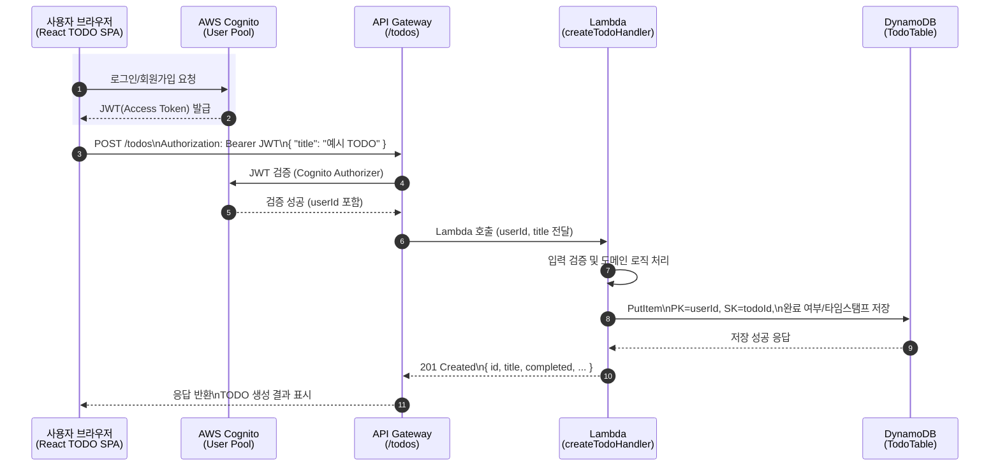
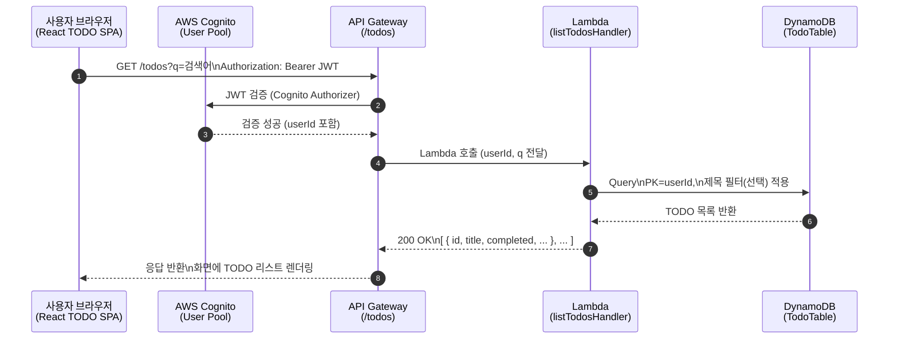

## TODO 웹 앱 설계서

`docs/todo_app_requirements.md`에 정리된 요구사항을 기반으로 한 설계 문서이다.

---

### 1. 전체 아키텍처 개요

- **아키텍처 다이어그램**
  - `docs/todo_app_architecture.svg` 파일에 전체 구조를 SVG 다이어그램으로 정리했다.

- **클라이언트(프론트엔드)**
  - React + Vite 기반 SPA
  - Tailwind CSS로 스타일링
  - 상태 관리: React Context + useReducer
  - GitHub Pages에 정적 배포
  - GitHub Actions로 CI/CD 구성

- **백엔드**
  - AWS API Gateway + Lambda (Node.js / TypeScript)
  - DynamoDB에 TODO 데이터 저장
  - AWS CDK로 인프라를 코드로 관리(IaC)

- **인증**
  - AWS Cognito User Pool
  - 프론트엔드에서 로그인/회원가입 UI 제공
  - 인증 후 발급된 JWT를 API 호출 시 Authorization 헤더로 전달

---

### 2. 도메인 모델 및 데이터 설계

#### 2.1 TODO 도메인

- **핵심 속성**
  - `id` (string): TODO 고유 ID (UUID)
  - `userId` (string): Cognito에서 내려오는 사용자 식별자
  - `title` (string): TODO 제목 (필수)
  - `completed` (boolean): 완료 여부 (기본값: false)
  - `createdAt` (string, ISO8601): 생성 시각
  - `updatedAt` (string, ISO8601): 마지막 수정 시각

#### 2.2 DynamoDB 테이블 설계

- **테이블 이름**: `TodoTable`
- **파티션 키(PK)**: `userId` (string)
- **정렬 키(SK)**: `todoId` (string)
- **속성**
  - `userId` (PK)
  - `todoId` (SK)
  - `title`
  - `completed`
  - `createdAt`
  - `updatedAt`

---

### 3. API 설계 (API Gateway + Lambda)

모든 엔드포인트는 Cognito JWT 인증을 통과한 사용자만 호출할 수 있으며, `userId`는 토큰에서 추출한다.

- **POST /todos**
  - 설명: 새로운 TODO 생성
  - 요청 바디: `{ "title": string }`
  - 응답: 생성된 TODO 객체

- **GET /todos**
  - 설명: 현재 사용자 TODO 전체 목록 조회
  - 쿼리 파라미터:
    - `q` (선택): 제목 부분 일치 검색용 키워드
  - 응답: TODO 배열

- **PATCH /todos/{todoId}**
  - 설명: TODO 일부 속성 수정 (주로 `title`, `completed`)
  - 요청 바디: `{ "title"?: string, "completed"?: boolean }`
  - 응답: 수정된 TODO 객체

- **DELETE /todos/{todoId}**
  - 설명: TODO 삭제
  - 응답: 204 No Content 또는 간단한 결과 JSON

---

### 4. 프론트엔드 설계

#### 4.1 화면 구성

- **메인 페이지 (단일 페이지)**
  - 상단 헤더: 앱 제목, 간단한 소개
  - TODO 입력 영역: 입력 필드 + 추가 버튼
  - 필터 영역: 전체 / 진행중 / 완료
  - 검색 입력: 제목 기준 검색
  - 목록 영역: TODO 리스트
    - 체크박스(완료 토글), 제목, 삭제 버튼, (선택) 인라인 수정

#### 4.2 폴더 구조(예시)

- `src/`
  - `components/`
    - `TodoInput.tsx`
    - `TodoList.tsx`
    - `TodoItem.tsx`
    - `FilterBar.tsx`
    - `SearchBar.tsx`
  - `context/`
    - `TodoContext.tsx` (Context + Provider)
  - `reducers/`
    - `todoReducer.ts` (상태 전이 로직)
  - `services/`
    - `api.ts` (백엔드 API 호출 래퍼)
    - `auth.ts` (Cognito 연동 헬퍼)
  - `pages/`
    - `TodoPage.tsx`
  - `types/`
    - `todo.ts` (Todo 타입 정의)

#### 4.3 상태 관리 설계

- **전역 상태**
  - `todos: Todo[]`
  - `filter: "all" | "active" | "completed"`
  - `searchQuery: string`
  - `loading: boolean`
  - `error: string | null`

- **액션 예시**
  - `ADD_TODO`
  - `UPDATE_TODO`
  - `DELETE_TODO`
  - `SET_FILTER`
  - `SET_SEARCH_QUERY`
  - `SET_TODOS` (초기 로딩/동기화)

---

### 5. 백엔드 Lambda 설계

- 공통 사항
  - 각 Lambda 핸들러는 API Gateway 이벤트에서 JWT를 파싱해 `userId` 추출
  - DynamoDB SDK를 사용해 `userId`를 기준으로 항목을 조회/저장
  - 공통 에러 핸들링/응답 포맷 유틸을 별도 모듈로 분리

- 핸들러 예시
  - `createTodoHandler`
  - `listTodosHandler`
  - `updateTodoHandler`
  - `deleteTodoHandler`

---

### 6. 인증/보안 설계

- **Cognito**
  - User Pool을 생성하고, 호스티드 UI 또는 자체 로그인 폼을 통해 로그인/회원가입
  - 로그인 성공 시 액세스 토큰/JWT를 프론트엔드에서 보관(예: 메모리 또는 안전한 스토리지)

- **API Gateway**
  - Cognito Authorizer를 사용해 JWT 검증
  - 허용 오리진(CORS)을 GitHub Pages 도메인으로 제한

- **DynamoDB 접근**
  - Lambda 실행 역할(IAM Role)에 최소 권한 부여 (해당 테이블에 대한 CRUD만 허용)

---

### 7. 테스트 전략 (TDD 용)

- **프론트엔드**
  - Jest + React Testing Library
  - 핵심 시나리오에 대해 TDD 진행
    - TODO 추가/삭제/완료 토글
    - 필터/검색 동작
    - API 실패 시 에러 메시지 표시

- **백엔드**
  - TypeScript + Jest
  - Lambda 핸들러 단위 테스트
  - 도메인 로직을 순수 함수로 분리하여 TDD로 구현

---

### 8. 배포 및 CI/CD

- **프론트엔드**
  - GitHub Actions 워크플로에서 Vite 빌드 후 `dist`를 GitHub Pages에 배포

- **백엔드/인프라**
  - CDK 프로젝트로 스택 정의 (API Gateway, Lambda, DynamoDB, Cognito)
  - GitHub Actions에서 CDK를 통한 배포 명령(`cdk deploy`) 실행 (필요 시)

---

### 9. 구현 우선순위

1. CDK 없이도 로컬에서 TDD 가능한 **도메인 로직 및 API 스펙** 먼저 정리
2. 프론트엔드: TODO 목록/추가/삭제/완료 토글까지의 최소 기능 구현 및 테스트
3. 백엔드: `POST /todos`, `GET /todos`부터 구현 후 `PATCH`, `DELETE` 확장
4. Cognito 연동 및 인증된 요청으로 전환
5. GitHub Actions + GitHub Pages, CDK 기반 배포 자동화

---

### 10. 요청 처리 시퀀스 다이어그램 (Mermaid)

#### 10.1 인증된 TODO 생성 요청 (`POST /todos`)

#### 10.2 TODO 목록 조회 요청 (`GET /todos`)

